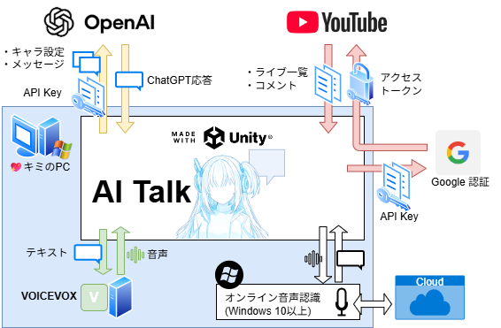
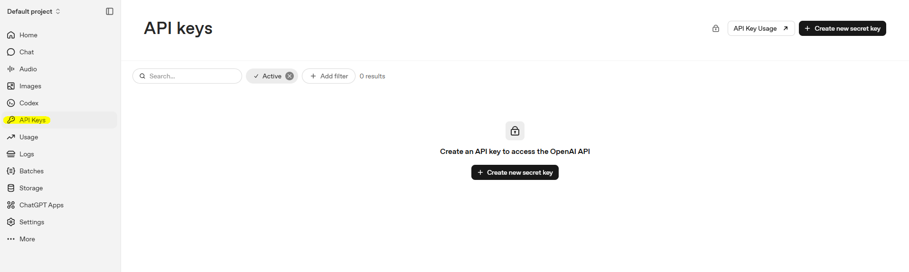
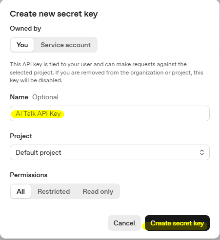

# ai-talk

AI Talkは、Unityで制作した、AI Vライバー構築アプリです。
このアプリに含まれる機能の概要を図に示します

# ユーザーガイド

## クイックスタート
[こちら](https://github.com/magic-sword/ai-talk/releases/)から最新バージョンの実行ファイルをダウンロードしてください
aitalk.zip

アプリ起動後、「Chat GPT」のメニューボタンを押して、必要な設定ファイルを登録してください(詳細は後述)
* Key選択: API Keyを記載したテキストファイルを選択
* キャラ選択: キャラ設定を記載してテキストファイルを選択

設定完了後、「🎙」のメニューボタンから、音声入力またはテキストの直接入力で、AIとコミュニケーションができます

## Chat GPT API Key

以下の「OpenAI Platform」サイトにアクセスします
https://platform.openai.com/api-keys

ログインを求められるため、お持ちでない方はアカウントを作成してください
Googleアカウントをお持ちの方は、「Google で続行」が便利でオススメです

ログイン完了後、「API keys」のダッシュボード画面が表示されます。
(Home画面が表示されている場合は、上記URLへ再度アクセスするか、左のサイドメニューから「API keys」を選択してください)

ダッシュボード画面右上の「Create new secret key」ボタンをクリックと、API Key作成ダイアログが表示されます。
任意の名前を入力して、「Create secret key」ボタンを押下します。

API Key作成完了ダイアログが表示されます
作成されたAPI Keyのテキストをコピーして、メモ帳などでテキストファイルに保存してください

:::note warn
警告
API Keyが表示されるのは、このダイアログのみです。
閉じると再表示する方法はないので、忘れずに保存しましょう。

API Keyを紛失してしまった場合は、古いものを削除し、新しいものを作り直しましょう。
:::

## キャラ設定ファイル

キャラクターの性格や過去の背景など、必要な設定をAIへ伝えます

[こちら](Readmes/chat-gpt/Developer_Massage.txt)から設定例をダウンロードできます。
メモ帳などで開き、ファイル前半に記載されているキャラクター設定を自由に編集してください

### ライブ配信コメント認識
`ライブ配信を見てくれているリスナーからは、以下の形式でコメントが届きます。...`

これは、ライブ配信コメントと、ユーザーの入力を区別するための指示です。
Youtube連携機能を使ってライブ配信のコメントを読み込んだとき、AI Talkでは以下の形式でChat GPTへ送信します

`コメント:[コメント日時](リスナー表示名)「メッセージ」`

設定例ファイルに記載の上記の指示によって、配信のコメントとユーザーの入力を混同しなくなります

### 表情出力

`応答文の最初には必ず、以下の形式であなたの表情を出力してください`

AI Talkでは、GPTから返答されたテキスト最初で、以下の形式の表情を解析しています
表情['表情する表情の名前']

解析された表情の名前によって、Unity内で表情を切り替える仕組みになっています。
表情の追加など、より高度な設定をした場合は、この指示の修正も検討してください。
